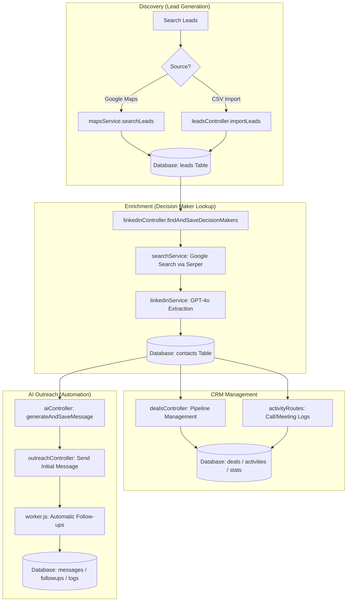
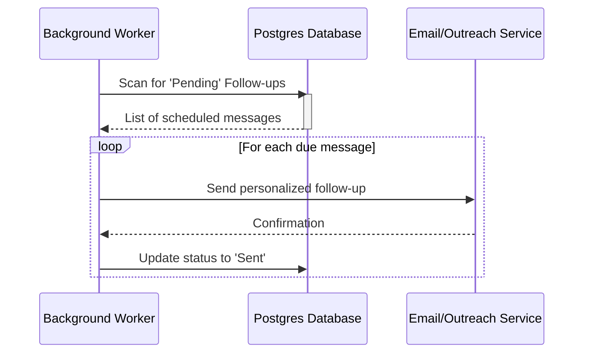

# AI-Powered B2B Outbound Sales Platform — API Workflow

This document outlines the core workflows of the platform's API as of March 20, 2026. The platform integrates Google Maps, AI Enrichment, and modern CRM capabilities for outbound sales.

---

## 1. Core Workflow Overview

The platform operates across four primary stages: **Discovery**, **Enrichment**, **Management**, and **Outreach**.

---

## 2. API Endpoint Breakdown

### 📍 Leads Discovery (`/api/leads`)
Handles the ingestion of raw business data.
- `POST /api/leads/search`: Uses the **Google Places API** to find businesses (e.g., "IT companies in Delhi").
- `POST /api/leads/import`: Imports leads from external sources (e.g., CSV).
- `GET /api/leads`: Retrieves all enriched leads for the main table.

### 🧠 LinkedIn Enrichment (`/api/linkedin`)
The "Smart Search" layer that finds real humans behind the businesses.
- `POST /api/linkedin/find`: 
    1. Triggers a live Google search via **Serper.dev**.
    2. Sends search snippets to **GPT-4o**.
    3. Saves real LinkedIn URLs and Founder names to the `contacts` table.

### ✉️ AI Message Engine (`/api/ai`)
Generates personalized outreach content.
- `POST /api/ai/generate`: Analyzes contact data (role, company name) and uses GPT-4o to write a custom LinkedIn/Email message.
- `GET /api/ai/contact/:id`: Fetches previously generated message variations.

### 📑 Pipeline & Stats (`/api/deals` & `/api/stats`)
- `/api/deals`: Manages deal stages (Prospect, Negotiation, Won, Lost).
- `/api/stats`: Real-time calculation of Conversion Rates and Pipeline Value.

---

## 3. Automation Worker Flow

The system includes a **background worker** (`worker.js`) that handles post-outreach automation.

---

## 4. Key Integration Dependencies

| Service | Used for... | Key / Configuration |
| :--- | :--- | :--- |
| **OpenAI GPT-4o / gpt-4o-mini** | Name extraction & Outreach generation | `OPENAI_API_KEY` |
| **Serper.dev** | Real Google search for LinkedIn profiles | `SERPER_API_KEY` |
| **Google Places** | Finding business locations & websites | `GOOGLE_PLACES_API_KEY` |
| **PostgreSQL** | Persistent storage for all CRM data | `DB_NAME`, `DB_HOST`, etc. |
| **Node.js / Express** | Core API framework | `PORT=5000` |
