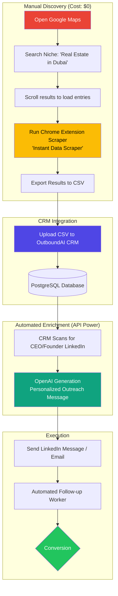

# 🚀 Hybrid Outreach Workflow (Google Maps + Chrome Extension)

This workflow combines manual lead gathering with automated AI outreach to save costs and maintain high lead quality.

## 📊 Process Flowchart

---

## 🛠️ Step-by-Step Guide

### 1. The Scraping Phase
*   **Search**: Go to [Google Maps](https://www.google.com/maps) and search for your target audience.
*   **Scrape**: Use a Chrome extension like **Instant Data Scraper** or **Outscraper Extension**. 
*   **Format**: Download the results as a **CSV** file.

### 2. The Import Phase
*   Inside your **OutboundAI Dashboard**, navigate to the **Leads** section.
*   Click the **Import CSV** button (to be implemented).
*   Map the columns: `Name`, `Website`, `Phone`, `Address`.

### 3. The AI Phase
*   The CRM will automatically take those leads.
*   It uses your **OpenAI API Key** to read the business details.
*   It writes a custom message like: *"Hi [Name], I saw your high rating for [Business] in Noida and loved your website..."*

### 4. The Outreach Phase
*   Review the generated message.
*   Click **Send**.
*   The **Follow-up Worker** takes over if they don't reply within 3 days.

---

## 💎 Why this is better?
1.  **Zero Scraper Cost**: You don't pay per search.
2.  **Highly Visual**: You see the business before importing it.
3.  **Human Verified**: You filter out "closed" or "badly rated" businesses manually during the scroll.
