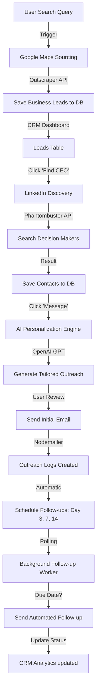

# 🚀 AI-Powered B2B CRM Workflow

This document outlines the end-to-end automation flow of the **OutboundAI CRM** platform, from lead discovery to automated follow-ups.

## 📊 System Flowchart



---

## 🛠️ Step-by-Step Breakdown

### 1. Lead Sourcing (Google Maps)
*   **Input:** User enters a niche and location (e.g., "Software companies in Bangalore").
*   **Action:** System calls **Outscraper API** to scrape business info from Google Maps.
*   **Outcome:** Business name, website, phone, and address are saved into the `leads` table.

### 2. Decision Maker Discovery (LinkedIn)
*   **Action:** For a selected business, the system uses **Phantombuster** to find key personnel (CEOs, Founders, CMOs).
*   **Outcome:** Names and LinkedIn URLs are stored in the `contacts` table, linked to the business lead.

### 3. AI Personalization Engine
*   **Action:** The system sends the contact's role and company data to **OpenAI GPT-4**.
*   **Process:** AI generates a short, non-spammy, highly relevant outreach message.
*   **Outcome:** Message is saved in the `messages` table and presented to the user for review.

### 4. Direct Outreach & tracking
*   **Action:** User clicks "Send". The system uses **Nodemailer** to deliver the email.
*   **Outcome:** An entry is created in `outreach_logs` to track that the initial contact has been made.

### 5. Automated Follow-up System
*   **Logic:** Upon the first email, the system automatically schedules a sequence of follow-ups at 3, 7, and 14-day intervals.
*   **Worker:** A background worker running in `backend/worker.js` checks the database every 10 minutes.
*   **Action:** If a follow-up is due, it sends the email automatically and updates the status to `sent`.

---

## 🏗️ Folder Architecture

```text
/AI-Powered B2B Outbound Sales Platform
├── /frontend           # React UI & Dashboards
│   ├── /src/pages      # Dashboard, Leads, Deals
│   └── /src/components # Reusable UI pieces
├── /backend            # Node.js Server
│   ├── /controllers    # API Route Logic
│   ├── /services       # AI, Maps, LinkedIn Integrations
│   ├── /routes         # API Endpoints
│   └── worker.js       # Follow-up Automation Brain
└── .env                # API Keys & DB Credentials
```
